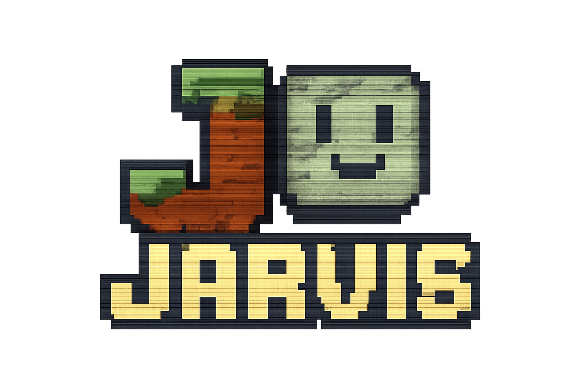

# Jarvis in Minecraft: Your Friendly AI Assistant  

Welcome to **Jarvis** — the ultimate AI assistant for your Minecraft adventures! Inspired by Iron Man's trusty sidekick, we're here to make your blocky world more dynamic and help you conquer all your Minecraft challenges with style.

## 🌟 What is Jarvis?

**Jarvis** is a Minecraft mod that leverages advanced AI-powered by a large language model to bring a whole new level of interactivity to your gameplay. Just type `/nl <natural language>` followed by your command and watch as Jarvis interprets your words and takes action. Whether you need to build a fortress, summon items, or pull off daring tricks, your AI assistant will have your back!

## 🚀 Features

- **Natural Language Processing**: Talk to Jarvis as you would to a friend! No more clunky commands—just plain language.
- **Task Automation**: Let Jarvis handle your tedious chores, from mining to crafting, so you can focus on the fun stuff.
- **Custom Commands**: Easily extend Jarvis's capabilities with custom commands tailored to your world.
- **Interactive Responses**: Get witty responses from Jarvis, making your gameplay experience not just efficient but also entertaining!

## 🎮 How to Get Started

1. **Install Minecraft**: Make sure you have Minecraft installed (preferably the latest version).
2. **Set Up Forge/Fabric**: Install Forge or Fabric as your mod loader (we recommend checking the official docs).
3. **Download the Jarvis Mod**: Grab the latest release from the [Releases page](https://github.com/yourusername/jarvis/releases).
4. **Drop It in the Mods Folder**: Move the downloaded `.jar` file into your `mods` directory.
5. **Launch Minecraft**: Start your game and get ready to meet Jarvis!

## 🛠 How to Use Jarvis

- **Invoke Jarvis**: Type `/nl <your command>` to start a conversation with your new AI friend.
- **Command Examples**:
    - `/nl Build me a castle`
    - `/nl Summon 64 diamonds`
    - `/nl Tell me a joke`

Jarvis will interpret your natural language and get to work! 🎉

## 📖 Contribution

We welcome contributions! Feel free to fork the repo and submit pull requests. Whether you'd like to fix a bug, add a feature, or help with the documentation, your efforts are appreciated!

## 🙏 Acknowledgments

- Big thanks to the incredible OpenAI and the community that makes AI accessible and exciting!
- Special shoutout to the Minecraft modding community for their endless inspiration and support.

## 🐛 Reporting Issues

If you encounter any bugs, or if Jarvis starts speaking nonsense, please report the issue on our [Issues page](https://github.com/yourusername/jarvis/issues).

## 💬 Get in Touch

Do you have questions or suggestions? Feel free to reach out:

- [GitHub Issues](https://github.com/yourusername/jarvis/issues)
- Join our [Discord Server](https://discord.com/invite/yourDiscordInvite) (if applicable).

## 📜 License

This project is licensed under the MIT License. See the [LICENSE](LICENSE) file for details.

---

So, what are you waiting for? Summon your AI assistant today and transform your Minecraft experience into something truly extraordinary! 😄